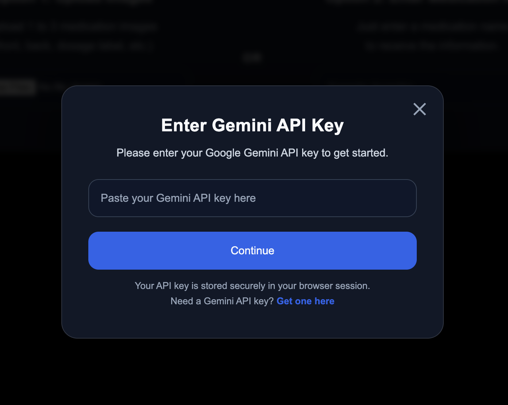
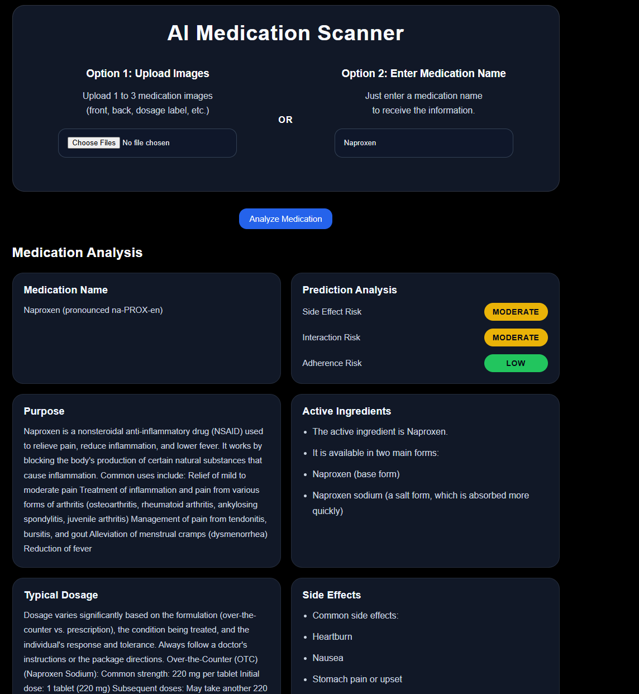
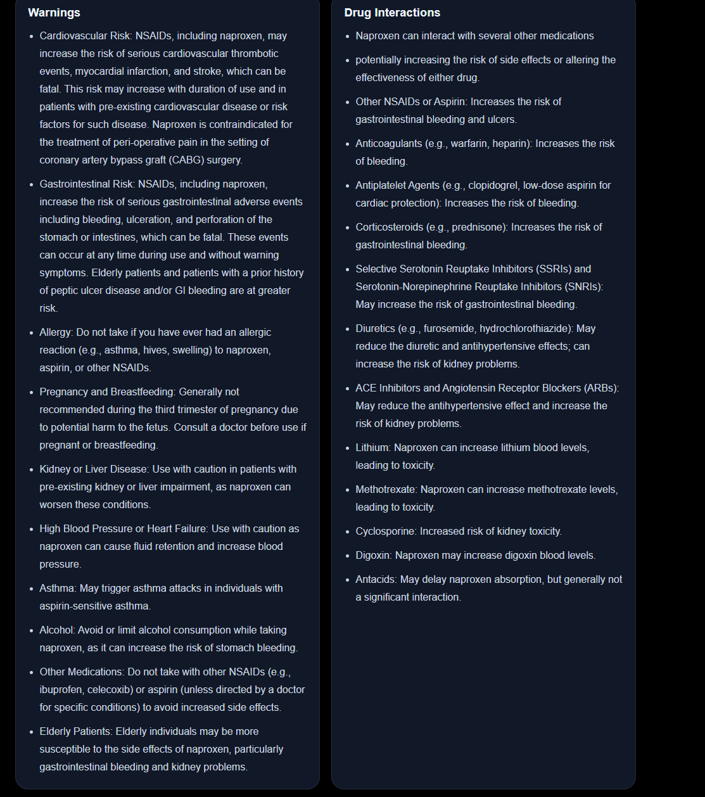

<div align="center">

## MediCap 

</div>

---

Many people have "TONS" of medication bottles at home but do not fully understand what each medication is used for, its possible side effects, or important safety warnings. So i made MediCap an AI Medication Scanner to make medication information more accessible for all, by combining image recognition and generative AI into a simple and easy-to-use web application.

MediCap is basically a Medication Scanner that lets the users either upload medication images or manually enter a medication name to get a detailed medication information where the backend is powered by Gemini AI, which helps give specific information about the medicine such as purpose, ingredients, dosage instructions, side effects, warnings, drug interactions, and AI-generated risk predictions.

---

## Features

### Upload Medication Images or Medication Name

* Upload 1–3 images of a medication bottle or Enter a medication name directly and AI Provides:

* Medication Name
* Purpose / Uses
* Active Ingredients
* Typical Dosage
* Side Effects
* Warnings
* Drug Interactions
* Storage Information
* Expiration Information - If visible in the image

### Prediction Analysis

AI generates:
* Side Effect Risk
* Drug Interaction Risk
* Adherence Risk

Risk levels are shows as either:

* Low
* Moderate
* High

---

## Screenshots

<div align="center">

### Home Page



<br><br>

### Medication Analysis Results



<br><br>



</div>

---

## Technologies Used

### Backend

* Python
* Flask

### AI

* Google Gemini 2.5 Flash API

### Frontend

* HTML
* CSS
* JavaScript

### Libraries

* Pillow
* python-dotenv

---
## Running

## You can open it up at 
```bash
https://medicationcap.vercel.app/
```

## Or run it locally
## Installation

### Clone the Repository

```bash
git clone https://github.com/ZamanZahid/MediCap.git
cd MediCap
```

### Install Dependencies

```bash
pip install -r requirements.txt
```

### Create a .env File

```env
GEMINI_API_KEY=YOUR_API_KEY_HERE
```

### Run the Application

```bash
python app.py
```

Open:

http://127.0.0.1:5000

---

## Future Improvements

* Medication history tracking
* User accounts
* Prescription upload support
* Personalized side-effect predictions
* Medication reminders and notifications
* PDF report generation

---

## Disclaimer

This app is make for educational and informational purposes only.
